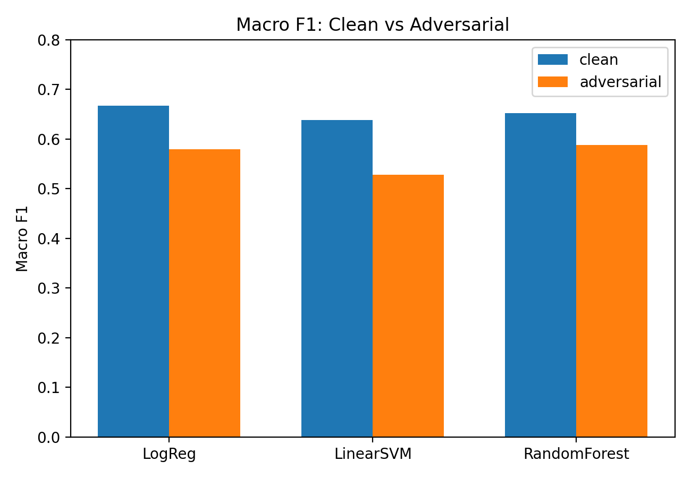
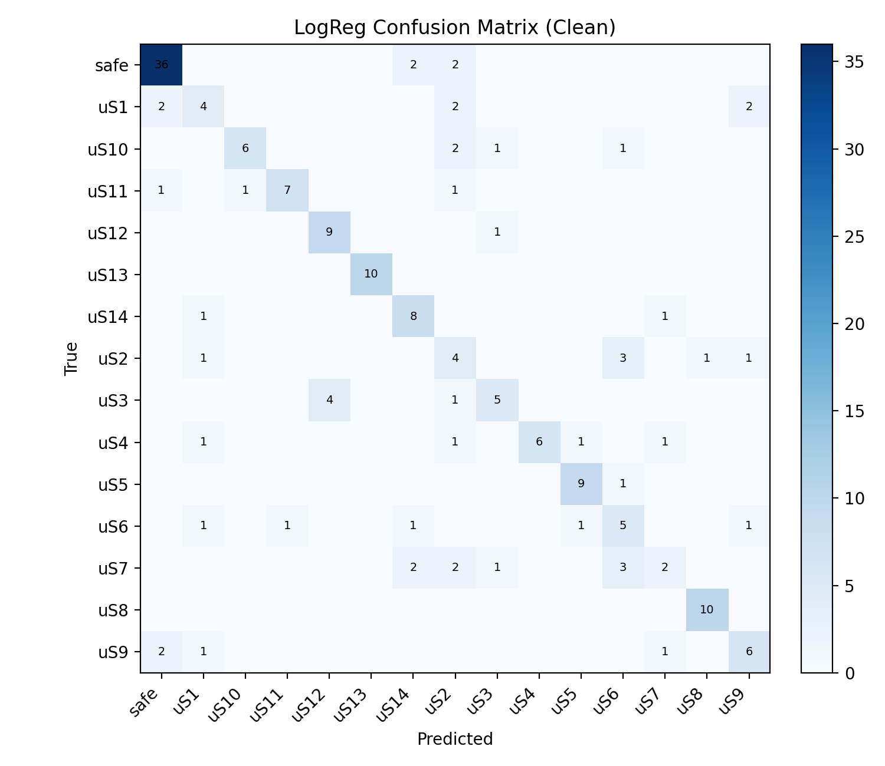
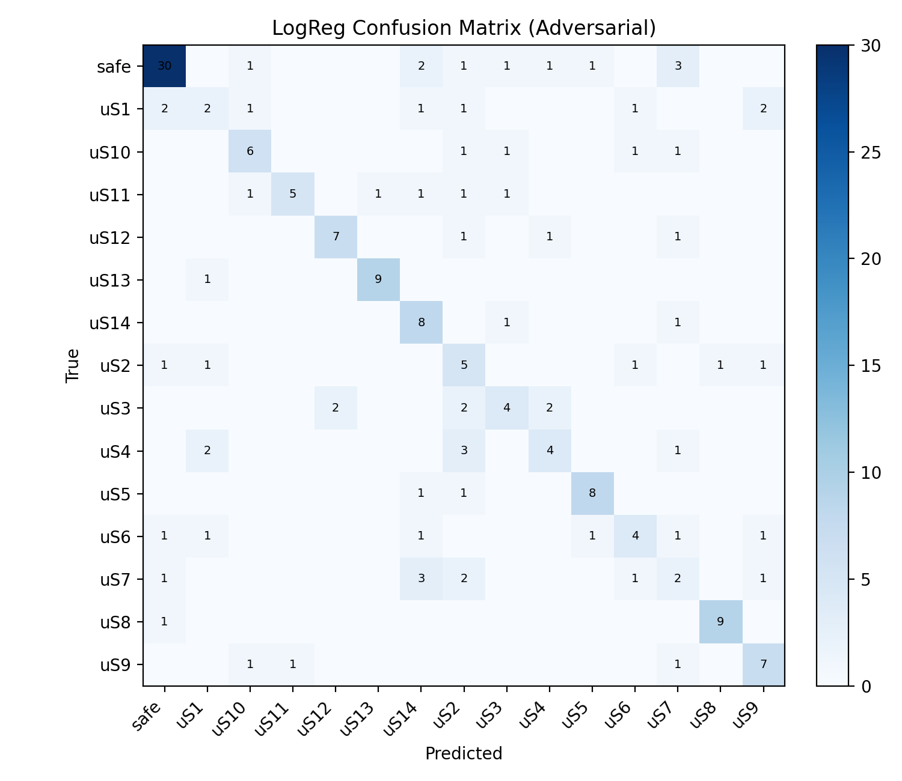

# PL-Guard Adversarial Robustness Study

Robustness analysis of text-safety embeddings and classifiers under adversarial perturbations on the Polish **NASK-PIB/PL-Guard** benchmark.

## Overview

This project evaluates how adversarially modified prompts affect:
- sentence embedding geometry,
- unsupervised clustering stability,
- supervised multi-class safety classification.

The work is implemented in a single, reproducible notebook and includes visual diagnostics, model comparison, and a simple adversarial training augmentation experiment.

## Dataset

- Source: `NASK-PIB/PL-Guard` (Hugging Face)
- Splits used:
  - `test` (original prompts)
  - `test_adversarial` (perturbed versions of the same prompts)
- Size analyzed: **900** samples
- Label space: `safe` + `unsafe` subclasses

## Methodology

### 1) Text Representation

- Model: `sentence-transformers/paraphrase-multilingual-MiniLM-L12-v2`
- Embedding size: **384**
- Normalization: L2 normalization for geometric comparability

### 2) Structure and Visualization

- Dimensionality reduction:
  - PCA (2D, 3D, and 50D for downstream processing)
  - t-SNE (direct and PCA-preprocessed)
  - UMAP
- Neighborhood quality metric: **trustworthiness** (`k=5,10,20`)

### 3) Clustering

- KMeans (`k=15`)
- Agglomerative clustering (Ward, `k=15`)
- DBSCAN and HDBSCAN (density-based behavior inspection)

### 4) Supervised Classification

- Logistic Regression
- Linear SVM
- Random Forest

Evaluation:
- clean test performance,
- adversarial test performance (same labels, perturbed text),
- performance drop and robustness comparison,
- optional adversarial train augmentation (`+30%` of train pairs).

## Main Results

### Dimensionality Reduction

- Best neighborhood preservation in this setup: **PCA(50) -> t-SNE**
- Trustworthiness (`k=5 / 10 / 20`):
  - `t-SNE (384->2D)`: `0.9532 / 0.9293 / 0.9045`
  - `PCA50->t-SNE (384->2D)`: `0.9646 / 0.9419 / 0.9189`
  - `UMAP (best tested config)`: `0.9481 / 0.9326 / 0.9076`

### Clustering Quality

- KMeans (`k=15`):
  - purity: `~0.571`
  - silhouette: `~0.05-0.07`
- Agglomerative (Ward, `k=15`):
  - purity: `~0.538`
  - silhouette: `~0.0786`

Interpretation: classes are only partially separable in embedding space and multiple categories overlap semantically.

### Adversarial Sensitivity

- Cluster assignment switch rate (original vs adversarial text): **21.33%** (`192/900`)

### Classification (Clean vs Adversarial)

- Best clean baseline: **Logistic Regression**
  - Accuracy: `0.706`
  - Macro F1: `0.667`
- Adversarial evaluation without retraining:
  - RandomForest: Accuracy `0.622`, Macro F1 `0.587`
  - LogReg: Accuracy `0.611`, Macro F1 `0.580`
  - LinearSVM: Macro F1 `0.528` (largest drop)
- After adversarial train augmentation (`+30%`):
  - LogReg clean: Accuracy `0.717`, Macro F1 `0.674`
  - LogReg adversarial: Accuracy `0.633`, Macro F1 `0.599`

## Figures





## Repository Structure

```text
.
├── fods_project.ipynb
├── ProjectReport.tex
├── figures/
│   ├── macro_f1_clean_vs_adv.png
│   ├── confusion_logreg_clean.png
│   └── confusion_logreg_adv.png
├── requirements.txt
├── .gitignore
└── README.md
```

## Setup

### Requirements

- Python 3.10+
- pip

Install dependencies:

```bash
python -m venv .venv
source .venv/bin/activate  # Windows: .venv\Scripts\activate
pip install --upgrade pip
pip install -r requirements.txt
```

## Run

```bash
jupyter notebook fods_project.ipynb
```

## Reproducibility Notes

- The notebook contains the full workflow from dataset loading to final tables/plots.
- Randomized components use fixed seeds where configured in the analysis.
- Notebook outputs are intentionally kept in-repo to make result inspection immediate after clone.

## Limitations

- This is a benchmark-focused study, not a production moderation pipeline.
- Robustness gains from simple augmentation are meaningful but limited.
- Dense and centroid-based clustering assumptions are not always well aligned with semantic label geometry.

## Ethics and Safety

- The dataset includes harmful and sensitive text categories.
- This repository is intended for safety/robustness research and model evaluation.

## Next Improvements

- Add pinned dependency versions for stricter reproducibility.
- Add a script-based pipeline (`src/` + CLI) in addition to notebook execution.
- Add experiment tracking/export of final metric tables as CSV artifacts.
